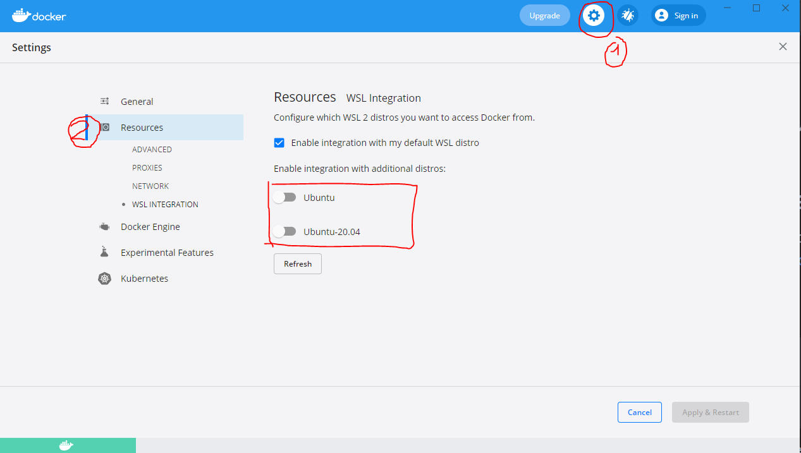
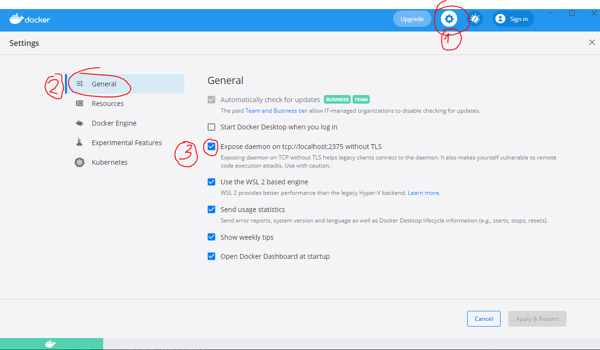

# Docker playground
## Requirements
Install docker desktop, WSL 2
https://docs.docker.com/desktop/windows/install/
In docker desktop:

list all containers:

    docker ls -a

    
    docker ps -a 

containers vs images

Images can exist without containers, whereas a container needs to run an image to exist. 
Therefore, containers are dependent on images and use them to construct a run-time environment and run an application.
containers can be 2 the same image

## volumes    
1. Downloaded newer image for ubuntu:latest and open an interactive container instance.

    docker run -it ubuntu /bin/bash

 flag it = -it is short for --interactive + --tty 

when you docker run with this command.. it would take you straight inside of the container,, where -d is short for --detach which means you just run the container and then detach from it so basically you run container in the background.. edit : so if you run docker container with-itd it would run the-it options and detach you from the container, so your container still running in the background even without any default app to run.

-t: pseudo tty, or "pseudo terminal". Without a terminal, you can't send inputs to the container.
flag -v = volume
2. Get what images have
docker images
3. 

    docker run -it -v /mnt/c/Users/name-user/test2:/hello ubuntu /bin/bash

3. :ro read only 

    docker run -it -v /mnt/c/Users/name-user/test2:/hello:ro ubuntu /bin/bash

## Dockerfile
Dockerfile

    FROM ubuntu:latest
    WORKDIR /app
    COPY test.txt test-image.txt 
    CMD ["cat", "test-image.txt"]

-t, --tag = tag name
-f, --file    
    docker build -t test-ubuntu-cat-file .

    docker images
or

    docker image ls
not

    docker images ls
You filter images !!!

    docker run test-ubuntu-cat-file
new image new container

docker/app.Dockerfile
   docker/nginx.Dockerfile
    $ docker build -f dockerfiles/Dockerfile.debug -t myapp_debug .
$ docker build -f dockerfiles/Dockerfile.prod  -t myapp_prod .
    docker run test-ubuntu-cat-file

    echo "Hello" > test.txt
    

    public class MainProgram {
        public static void main(String... args) {
        System.out.println("Hello world");
    }
    MainProgram.java
        basic image name: openjdk:11
        compilation: javac MainProgram.java
        java MainProgram
        COPY, WORKDIR, CMD
        RUN <- run command
    docker build not work on company laptop
    not working,  docker pull openjdk:11
     
    
    wsl --set-version Ubuntu:20.04 2
    
     
    
    wsl --list
    
     
    
    https://docs.docker.com/desktop/windows/install/
    
     
    
    https://docs.microsoft.com/en-us/windows/wsl/install-win10
    
     
    
    sudo apt-get update
 $ sudo apt-get install docker-ce docker-ce-cli containerd.io
 
docker favorite flags:
* build:
-t, --tag
--network
run:
-p for ports
-v for volume
* compose --detach
--volumes

    docker container prune 

delete all stopped containers
    
    docker volume ls

not delete with restart 
must delete it

container and image stateless, volumes state

### communicate between two containers, network

docker network create my-network
docker run -it --network my-network ubuntu /bin/bash
    docker network ls
network drivers:
* bridge
* host

docker network inspect my-network

apt update

apt install iputils-ping

ping 172.0.

### ports

web servers for example httpd
docker run -p 8081:80 httpd 

docker run -p 8082:80 httpd 

### docker compose
    docker ps

    docker compose -f .\docker-compose.yml up my-server
    
    docker compose -f .\docker-compose.yml up postgres-db

postgres sql volume when start 
./dev/postgres/init:/docker-entrypoint-initdb.d:ro

check testconntainers.postgers

docker hub

### links
https://stackoverflow.com/questions/45766531/why-is-docker-images-list-empty
https://docs.docker.com/engine/reference/commandline/build/
https://stackoverflow.com/questions/26077543/how-to-name-dockerfiles
https://miykael.github.io/nipype_tutorial/notebooks/introduction_docker.html
https://stackoverflow.com/questions/23735149/what-is-the-difference-between-a-docker-image-and-a-container
https://docs.docker.com/engine/reference/run/?fbclid=IwAR23Wl6-ns4L0ypXG-OWiFKSxgG0ej25bX-qwYdsK4NAwNka0i4rEIVglLY